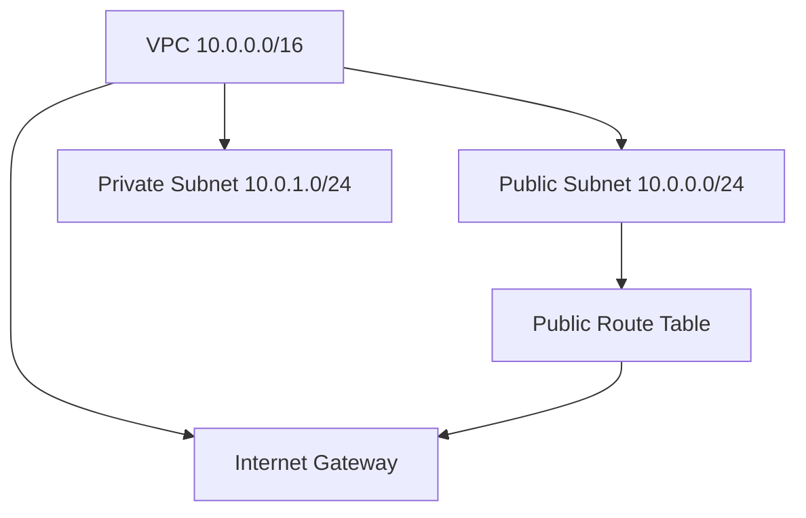

# Solved Terraform Exercises

This directory contains my solutions to Terraform exercises as part of my learning journey.

## Structure

Each exercise is placed in its own folder, for example:

```
solved-exercises/
├── .env
├── .gitignore
├── exercise01/
│   └── <files>
├── exercise02/
│   └── vpc.tf
...
```

- `.env` holds environment variables and is excluded from this repo (e.g., AWS credentials, region).
- `.gitignore` excludes sensitive files and Terraform state.
- Each `exerciseXX` folder contains its own Terraform configuration.

### exercise02
Provisions a VPC (`10.0.0.0/16`) with one public subnet, one private subnet, an Internet Gateway, a public route table, and the correct association for Internet access.


## Usage

1. Navigate to the exercise folder you want to run:
   ```bash
   cd exercise02
   ```

2. Initialize Terraform (downloads providers and modules):
   ```bash
   terraform init
   ```

3. Plan the infrastructure changes:
   ```bash
   terraform plan
   ```

4. Apply the configuration to create resources:
   ```bash
   terraform apply
   ```

## Notes

- Before running Terraform, load environment variables from `.env` (from inside an exercise folder):
  ```bash
  set -a
  source ../.env
  set +a
  ```

- Make sure you have AWS CLI configured and working:
  ```bash
  aws sts get-caller-identity
  ```

## License

This project is for learning purposes only.