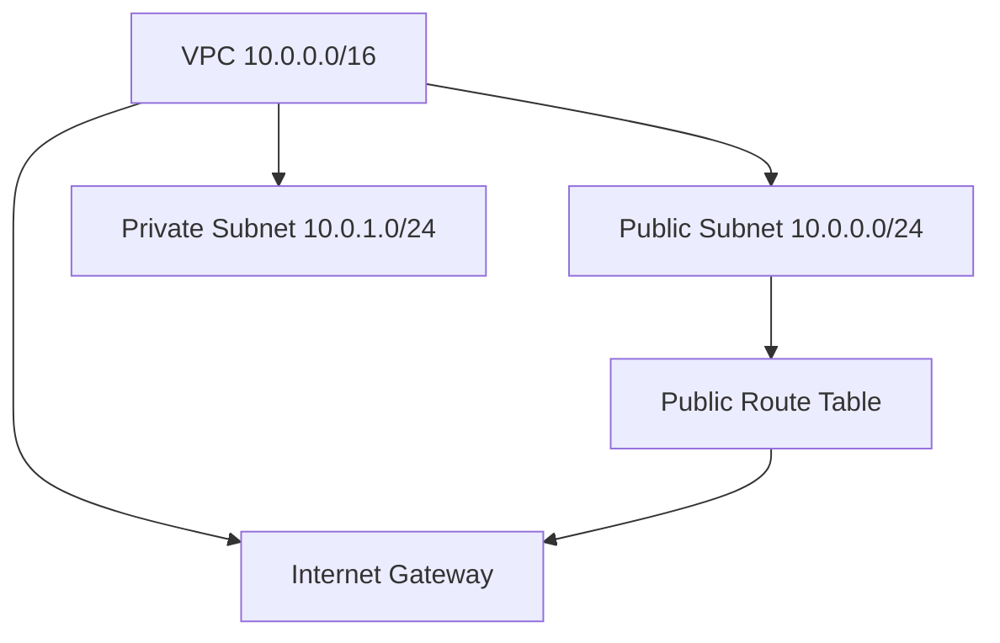

# Solved Terraform Exercises

This directory contains my solutions to Terraform exercises as part of my learning journey.

## Structure

Each exercise is placed in its own folder, for example:

```
solved-exercises/
├── .env
├── .gitignore
├── exercise01/
│   └── <files>
├── exercise02/
│   └── vpc.tf
...
```

- `.env` holds environment variables and is excluded from this repo (e.g., AWS credentials, region).
- `.gitignore` excludes sensitive files and Terraform state.
- Each `exerciseXX` folder contains its own Terraform configuration.

### logs-collecting-with-fluentd
This sample demonstrates using Docker Compose with two Bash script loggers and Fluentd to collect and filter logs.

The directory structure is as follows:

```
logs-collecting-with-fluentd/
├── docker-compose.yaml          # orchestrates services (file-logger-a, file-logger-b, and Fluentd)
├── file-logger/
│   └── app.sh                   # Bash script that generates random log events with kubernetes.
├── file-logger-logs/
│   ├── app-a.log                # log file written by the file-logger-a container
│   └── app-b.log                # log file written by the file-logger-b container
├── fluentd-configurations/
│   └── fluent.conf              # Fluentd configuration for filtering logs
└── fluentd-filtered-logs/
    └── merged.log               # merged filtered logs from both loggers (with buffer and meta files)
```

The sample works as follows:

- The `file-logger-a` container runs a Bash script (`app.sh`) that writes random INFO, DEBUG, or ERROR events in JSON format to `file-logger-logs/app-a.log` with a simulated `kubernetes.namespace_name` field set to `fnlgr-demo`.
- The `file-logger-b` container runs a similar Bash script writing to `file-logger-logs/app-b.log` with `kubernetes.namespace_name` set to `statsvc-env5`.
- Each log event looks like this:

  ```json
  {"timestamp":"2025-09-22T11:38:54Z","level":"INFO","kubernetes":{"namespace_name":"fnlgr-demo"},"id":"398e6587-808f-4146-8883-495112d68bb8","message":"Heartbeat OK"}
  ```

- A Fluentd container tails both log files, parses each line as JSON, and filters records by:
  - ERROR events from namespaces matching the pattern `fnlgr-*`
  - INFO events from the namespace exactly `statsvc-env5`
- All filtered logs are merged into one file `fluentd-filtered-logs/merged.log`.
- The core part of the Fluentd configuration (`fluent.conf`) that performs the filtering is:

  ```conf
  <filter **>
    @type grep
    <regexp>
      key $.kubernetes.namespace_name
      pattern ^fnlgr-
    </regexp>
  </filter>
  <filter **>
    @type grep
    <regexp>
      key level
      pattern ^ERROR$
    </regexp>
  </filter>

  <filter **>
    @type grep
    <regexp>
      key $.kubernetes.namespace_name
      pattern ^statsvc-env5$
    </regexp>
  </filter>
  <filter **>
    @type grep
    <regexp>
      key level
      pattern ^INFO$
    </regexp>
  </filter>
  ```

#### Usage

1. Start the environment with:
   ```bash
   docker compose up -d
   ```
2. Watch log files under `file-logger-logs/app-a.log` and `file-logger-logs/app-b.log`.
3. View merged filtered logs under `fluentd-filtered-logs/merged.log`.

#### Notes

- Only ERROR events from namespaces matching `fnlgr-*` and INFO events from the namespace `statsvc-env5` are collected by Fluentd into the merged filtered logs.
- This setup is for demonstration purposes and can be extended for more complex log filtering and processing.

### exercise02
Provisions a VPC (`10.0.0.0/16`) with one public subnet, one private subnet, an Internet Gateway, a public route table, and the correct association for Internet access.


#### Usage

1. Navigate to the exercise folder you want to run:
   ```bash
   cd exercise02
   ```

2. Initialize Terraform (downloads providers and modules):
   ```bash
   terraform init
   ```

3. Plan the infrastructure changes:
   ```bash
   terraform plan
   ```

4. Apply the configuration to create resources:
   ```bash
   terraform apply
   ```

#### Notes

- Before running Terraform, load environment variables from `.env` (from inside an exercise folder):
  ```bash
  set -a
  source ../.env
  set +a
  ```

- Make sure you have AWS CLI configured and working:
  ```bash
  aws sts get-caller-identity
  ```