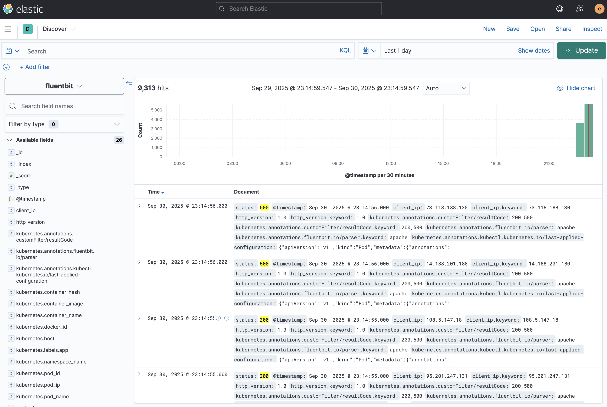

# Logs Collecting with Fluent Bit

This project contains Kubernetes manifests and Docker Compose setups to experiment with log collection using **Fluent Bit**, Elasticsearch, and Kibana.

## Recent Changes and Features

### Fluent Bit RBAC
- Added `fluent-bit/rbac-fluent-bit.yaml` to grant Fluent Bit access (`get/list/watch`) to Pods and Namespaces.
- DaemonSet (`fluent-bit-ds-minikube.yaml`) updated to run with the `fluent-bit` ServiceAccount.

### Kubernetes Metadata Enrichment
- Enabled the Kubernetes filter in [`fluent-bit-configmap.yaml`](fluent-bit/fluent-bit-configmap.yaml) to enrich logs with:
  - Pod name, namespace
  - Labels
  - Custom annotations

### Lua Filter for HTTP Status Codes
- `resultCodeFilter.lua` filters logs based on pod annotations.
- Example pod annotation:
  ```yaml
  metadata:
    annotations:
      logs.example.com/resultCodeFilter: "200,500"
  ```
- Example json of Apache event in ES
  ```json
  {
  "_index": "fluentbit",
  "_type": "_doc",
  "_id": "SzddnJkBzQRob4dcY3Bu",
  "_version": 1,
  "_score": null,
  "fields": {
    "kubernetes.pod_id.keyword": [
      "ef639593-5c5c-48f7-be57-710e7f7d4fba"
    ],
    "kubernetes.pod_ip": [
      "10.244.0.43"
    ],
    "stream.keyword": [
      "stdout"
    ],
    "kubernetes.annotations.fluentbit.io/resultCodeFilter": [
      "200,500"
    ],
    "status.keyword": [
      "500"
    ],
    "client_ip.keyword": [
      "13.214.232.89"
    ],
    "kubernetes.container_image.keyword": [
      "edsiper/apache_logs:latest"
    ],
    "path": [
      "/ALEXIS"
    ],
    "kubernetes.annotations.fluentbit.io/resultCodeFilter.keyword": [
      "200,500"
    ],
    "kubernetes.labels.app": [
      "apache-logs"
    ],
    "stream": [
      "stdout"
    ],
    "kubernetes.labels.app.keyword": [
      "apache-logs"
    ],
    "kubernetes.container_image": [
      "edsiper/apache_logs:latest"
    ],
    "client_ip": [
      "13.214.232.89"
    ],
    "method.keyword": [
      "GET"
    ],
    "kubernetes.host": [
      "minikube"
    ],
    "kubernetes.docker_id.keyword": [
      "ff0749adcdb067624cd14a27e4b67b1a8bdabf29343b9201f7a67c04d53e5b62"
    ],
    "kubernetes.pod_name.keyword": [
      "apache-logs"
    ],
    "kubernetes.namespace_name.keyword": [
      "default"
    ],
    "http_version.keyword": [
      "1.0"
    ],
    "kubernetes.host.keyword": [
      "minikube"
    ],
    "kubernetes.annotations.fluentbit.io/parser.keyword": [
      "apache"
    ],
    "method": [
      "GET"
    ],
    "kubernetes.container_name": [
      "apache"
    ],
    "kubernetes.container_hash": [
      "edsiper/apache_logs@sha256:ffe6bd86991091070e64e016b72e88b8494427ec110957937f5dae8e90c208f4"
    ],
    "kubernetes.annotations.fluentbit.io/parser": [
      "apache"
    ],
    "http_version": [
      "1.0"
    ],
    "kubernetes.pod_ip.keyword": [
      "10.244.0.43"
    ],
    "kubernetes.namespace_name": [
      "default"
    ],
    "kubernetes.container_name.keyword": [
      "apache"
    ],
    "kubernetes.container_hash.keyword": [
      "edsiper/apache_logs@sha256:ffe6bd86991091070e64e016b72e88b8494427ec110957937f5dae8e90c208f4"
    ],
    "kubernetes.docker_id": [
      "ff0749adcdb067624cd14a27e4b67b1a8bdabf29343b9201f7a67c04d53e5b62"
    ],
    "@timestamp": [
      "2025-09-30T20:43:10.000Z"
    ],
    "size": [
      "2216"
    ],
    "kubernetes.pod_id": [
      "ef639593-5c5c-48f7-be57-710e7f7d4fba"
    ],
    "size.keyword": [
      "2216"
    ],
    "kubernetes.annotations.kubectl.kubernetes.io/last-applied-configuration": [
      "{\"apiVersion\":\"v1\",\"kind\":\"Pod\",\"metadata\":{\"annotations\":{\"fluentbit.io/parser\":\"apache\",\"fluentbit.io/resultCodeFilter\":\"200,500\"},\"labels\":{\"app\":\"apache-logs\"},\"name\":\"apache-logs\",\"namespace\":\"default\"},\"spec\":{\"containers\":[{\"image\":\"edsiper/apache_logs\",\"name\":\"apache\",\"ports\":[{\"containerPort\":80}]}]}}\n"
    ],
    "kubernetes.pod_name": [
      "apache-logs"
    ],
    "time": [
      "2025-09-30T20:43:10.055Z"
    ],
    "status": [
      "500"
    ],
    "path.keyword": [
      "/ALEXIS"
    ]
  }
  ```
- Behavior:
  - Keep logs if status matches codes in the annotation.
  - Drop logs if status does not match.
  - Pass logs unchanged if no annotation present.

### Notes
- Use a custom annotation domain (`logs.example.com/...`) to avoid warnings about reserved `fluentbit.io/*` annotations.
- Logs are sent to Elasticsearch index `fluentbit` and can be viewed in Kibana.

### Secure Password Management
- Both Fluent Bit and Kibana configuration files have been updated to use an environment variable placeholder instead of a hardcoded password.
- Example in [`fluent-bit-configmap.yaml`](fluent-bit/fluent-bit-configmap.yaml):
  ```ini
  [OUTPUT]
      Name            es
      Match           *
      Host            elasticsearch.demo-elastic.svc.cluster.local
      Port            9200
      HTTP_User       elastic
      HTTP_Passwd     ${ELASTICSEARCH_PASSWORD}
  ```
- Example in [`Kibana-configmap.yaml`](elastic-search-kibana/Kibana-configmap.yaml):
  ```yaml
  data:
    elasticsearch_username: elastic
    elasticsearch_password: ${ELASTICSEARCH_PASSWORD}
  ```
- Set the `ELASTICSEARCH_PASSWORD` variable via a **Kubernetes Secret** or environment injection to secure credentials and avoid storing plaintext in ConfigMaps.

## Repository Structure

```
logs-collecting-with-fluent-bit/
├── pod-apache-logs.yaml                # Pod manifest generating sample Apache logs
├── README.md                           # Documentation and usage
├── elastic-search/                     # Elasticsearch manifests
│   ├── elasticsearch-configmap.yaml
│   ├── elasticsearch-deployment.yaml
│   ├── elasticsearch-pvc.yaml
│   └── elasticsearch-service.yaml
├── elastic-search-kibana/              # Kibana manifests (with ES connection)
│   ├── elasticsearch-kibana.yaml
│   ├── Kibana-configmap.yaml
│   └── Kibana-service.yaml
└── fluent-bit/                         # Fluent Bit manifests
    ├── fluent-bit-configmap.yaml
    ├── fluent-bit-ds-minikube.yaml
    └── logging-namespace.yml
```

## Notes
- Fluent Bit tails Kubernetes container logs from `/var/log/containers/*.log`.
- Logs are forwarded to Elasticsearch and stored in indices matching `flientbit`.
- In Kibana, create a **data view** (`flientbit`) with `@timestamp` as the time field to see logs.

### Example View in Kibana

Below is a screenshot of logs successfully ingested and displayed inside Kibana:



## Resources

- [Fluent Bit Documentation](https://docs.fluentbit.io/)
- [Elasticsearch Documentation](https://www.elastic.co/guide/en/elasticsearch/reference/index.html)
- [Kibana Documentation](https://www.elastic.co/guide/en/kibana/current/index.html)
- https://www.youtube.com/watch?v=7qL5wkAaSh4
- https://medium.com/@ismailwajdi39/deploying-elasticsearch-and-kibana-on-kubernetes-with-password-protection-fad93010563c

## Pod-level Filtering with Annotations

You can control Fluent Bit log collection per pod using Kubernetes annotations:

```yaml
metadata:
  annotations:
    fluentbit.io/exclude: "true"
```

This annotation tells Fluent Bit to **exclude logs from this pod**.

You can also specify which parser to apply for pod logs:

```yaml
metadata:
  annotations:
    fluentbit.io/parser: apache
```

This applies the `apache` parser for the pod’s logs, ensuring proper parsing and filtering.

## Example: Apache Log Parsing

The file [`pod-apache-logs.yaml`](pod-apache-logs.yaml) creates a pod that generates sample Apache access logs.
By applying the `fluentbit.io/parser: apache` annotation, these logs are parsed into structured fields (e.g. `client`, `method`, `path`, `status`).

This makes it possible to filter HTTP traffic in Kibana by **status codes**, **URLs**, and **request methods** rather than raw log lines.

### Steps:
1. Deploy the sample Apache pod:
   ```sh
   kubectl apply -f pod-apache-logs.yaml
   ```
2. Ensure your Fluent Bit `ConfigMap` contains the `apache` parser definition.
3. Check Kibana → Discover for logs structured as Apache fields.

✅ With this setup, troubleshooting web requests becomes easier since errors (e.g., `500` responses) and endpoints can be quickly identified.
