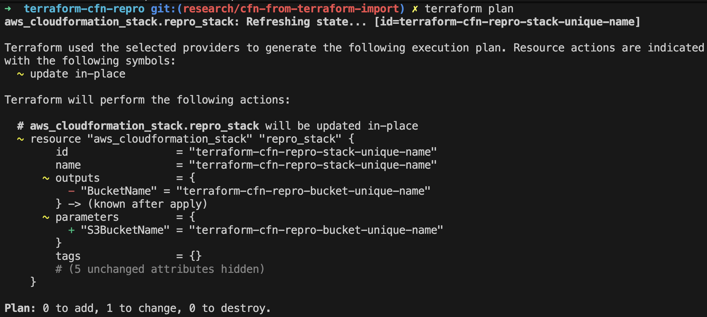

# Terraform CloudFormation Stack Reproduction

This project demonstrates a common issue where Terraform attempts to create a new CloudFormation stack instead of updating an existing one. This happens when a CloudFormation stack with the same name already exists in your AWS account but is not tracked in Terraform's state file.

## The Problem

When you define an `aws_cloudformation_stack` resource in Terraform for a stack that already exists, Terraform's default behavior is to plan a `create` operation. This is because the resource is not in its state file, so Terraform assumes it doesn't exist and needs to be created from scratch. This can lead to errors if the underlying resources (like an S3 bucket with a specific name) cannot be re-created.

The correct approach is to make Terraform "aware" of the existing stack by importing it into the state.

## Files

### `template.yaml`

```yaml
AWSTemplateFormatVersion: '2010-09-09'
Description: A simple CloudFormation template to create an S3 bucket.

Parameters:
  S3BucketName:
    Type: String
    Description: The name of the S3 bucket to create.

Resources:
  MyS3Bucket:
    Type: 'AWS::S3::Bucket'
    Properties:
      BucketName: !Ref S3BucketName

Outputs:
  BucketName:
    Description: The name of the created S3 bucket.
    Value: !Ref MyS3Bucket
```

### `variables.tf`

```terraform
variable "stack_name" {
  description = "The name of the CloudFormation stack."
  type        = string
  default     = "terraform-cfn-repro-stack-unique-name"
}

variable "bucket_name" {
  description = "The name of the S3 bucket to be created by the CloudFormation stack."
  type        = string
  # NOTE: Make sure this bucket name is unique!
  default     = "terraform-cfn-repro-bucket-unique-name"
}
```

### `main.tf`

```terraform
terraform {
  required_providers {
    aws = {
      source  = "hashicorp/aws"
      version = "~> 5.0"
    }
  }
}

provider "aws" {
  region = "eu-west-1"
}

resource "aws_cloudformation_stack" "repro_stack" {
  name = var.stack_name

  template_body = file("${path.module}/template.yaml")

  parameters = {
    S3BucketName = var.bucket_name
  }
}
```

## Steps to Reproduce

First, ensure you have set your AWS credentials in your environment. Remember to replace `terraform-cfn-repro-bucket-unique-name` with a globally unique bucket name in `variables.tf`.

**Step 1: Manually Create the Stack**

Create the CloudFormation stack directly using the AWS CLI. This simulates a pre-existing resource.

```bash
aws cloudformation create-stack \
  --stack-name terraform-cfn-repro-stack-unique-name \
  --template-body file://template.yaml \
  --parameters ParameterKey=S3BucketName,ParameterValue=terraform-cfn-repro-bucket-unique-name
```

Wait for the stack to be created successfully.

**Step 2: Run `terraform plan` (and see the problem)**

Initialize Terraform and run a plan.

```bash
terraform init
terraform plan
```

Terraform will propose creating a new stack, because it doesn't know the existing one is supposed to be managed by this resource.

```
+ resource "aws_cloudformation_stack" "repro_stack" {
    + name           = "terraform-cfn-repro-stack-unique-name"
    + template_body  = ...
    ...
  }
```

**Step 3: Import the Existing Stack**

Use `terraform import` to associate the existing stack with your Terraform resource.

```bash
terraform import aws_cloudformation_stack.repro_stack terraform-cfn-repro-stack-unique-name
```

**Step 4: Run `terraform plan` Again**

Now that the resource is tracked in the state, running a plan will show just template changes.

```bash
terraform plan
```



Terraform now correctly understands that the stack is already deployed and managed.