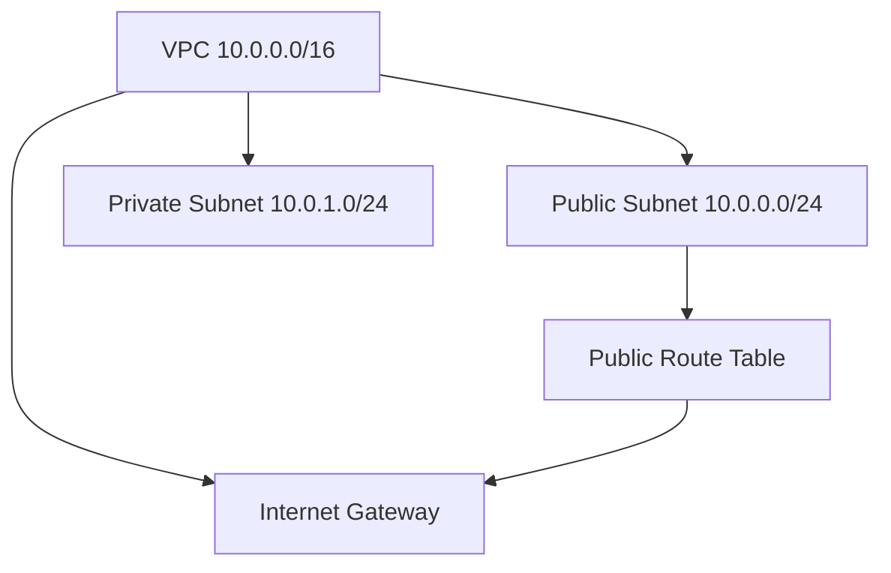

# Exercise 02 - VPC with Public and Private Subnets

This exercise provisions an AWS VPC (`10.0.0.0/16`) with the following components:

- **One public subnet** (`10.0.0.0/24`)
- **One private subnet** (`10.0.1.0/24`)
- **Internet Gateway (IGW)**
- **Public Route Table** with proper association for internet access

## Terraform Resources

Defined in [`vpc.tf`](vpc.tf):

- `aws_vpc` – creates the main VPC
- `aws_subnet` – defines the public and private subnets
- `aws_internet_gateway` – attaches an IGW to the VPC
- `aws_route_table` + `aws_route_table_association` – provides routing for the public subnet

## Architecture Diagram



## Usage

1. Navigate to the exercise folder:
   ```bash
   cd exercise02
   ```

2. Initialize Terraform (downloads providers and modules):
   ```bash
   terraform init
   ```

3. Review the execution plan:
   ```bash
   terraform plan
   ```

4. Apply the configuration to create resources:
   ```bash
   terraform apply
   ```

## Notes

- Load environment variables before running Terraform:
  ```bash
  set -a
  source ../.env
  set +a
  ```

- Ensure AWS CLI is configured and working:
  ```bash
  aws sts get-caller-identity
  ```
